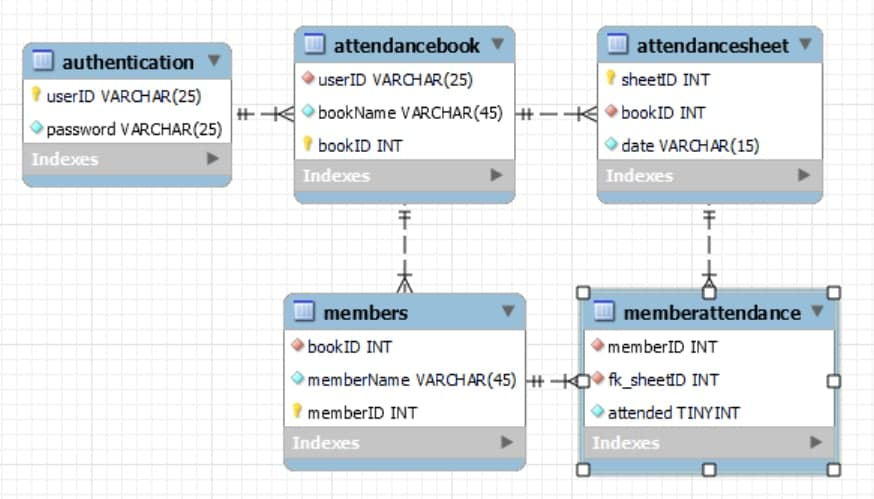

# Introduction

This is the backend of the Attendex app.

# How to use
1. Clone repo
2. `npm i` to install dependencies
3. Fill up .env file with database password, and secret keys
4. `npm run dev` to run the server with nodemon

# Tech Stacks used

1. Node.js (Express)
2. mysql2
3. MySQL database
4. JsonWebToken

# Enhanced Entity-Relationship Diagram

# Tables explained

1. `authentication` table
   - contains userID and passwords of all accounts
   - primary key is `userID`

2. `attendancebook` table
   - meant to represent a group of sheets, for example, a module has 13 lessons over 13 weeks, each lesson would be 1 sheet while the collection of 13 sheets is called an attendance book
   - contains userID that this book belongs to, name of book, bookID
   - primary key is `bookID`
   - foreign key `userID` references `userID` from `authentication` tables

3. `attendancesheet` table
   - meant to represent 1 date of the attendance book
   - contains sheetID, bookID that this sheet belongs to, and the date
   - primary key is `sheetID`
   - foreign key is `bookID` which references `bookID` from `attendancebook`

4. `members` table
   - meant to represent the list of members that a book would contain, for example, a module could have 100 students taking it and all 100 students will have to turn up for each individual lesson (sheet)
   - contains bookID, name of member, and memberID
   - primary key is `memberID`
   - foreign key is `bookID` which reference `bookID` from `attendancebook`
   
5. `memberattendance` table
   - meant to represent a single dates attendance list, much like a checklist to check if attendees are present for 1 session
   - contains sheetID that this date belongs to, memberID that this entry belongs to and whether the member in this sheet attended
   - first foreign key is `memberID` which reference `memberID` from `members` table
   - second foreign key is `fk_sheetID` which reference `sheetID` from `attendancesheet` table

# API Functions

1. Accounts
   - sign up
     - path: POST /signup
     - body: password
   - login
     - path: POST /login
     - body: userid, password
     - errors: 403 (wrong userid / password)
   - delete accounts
     - path: DELETE /deleteaccount

2. Attendance Book
   - add book
     - path: POST /addbook
     - body: bookname
   - delete book
     - path: DELETE /deletebook
     - body: bookid
   - get books
     - path: GET /getbook

3. Attendance Sheet
   - add sheet
     - path: POST /addsheet
     - body: bookid, date
   - delete sheet
     - path: DELETE /deletesheet
     - body: sheetid
   - get sheet
     - path: GET /getsheet
     - body: sheetid
   - get date
     - path: GET /getdate
     - body: bookid

4. Members
   - add member
     - path: POST /addmember
     - body: bookid, name
   - delete member
     - path: DELETE /deletemember
     - body: memberid
   - get members
     - path: GET /getmember
     - body: bookid

5. Member Attendance
   - update member attendance
     - path: PUT /updatememberattendance
     - body: sheetid, memberid, attended

All API calls has errors:
  - HTTP status code 400 (Bad Error) if input formats are wrong
  - HTTP status code 401 (Unauthorised) if JWT token expired or unverified
